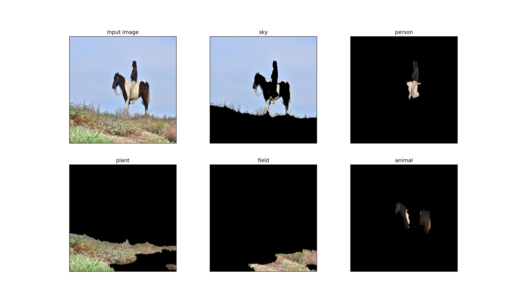

# PSPNet with PyTorch

Unofficial implementation of "Pyramid Scene Parsing Network" (https://arxiv.org/abs/1612.01105). This repository is just for caffe to pytorch model conversion and evaluation.

### Requirements

* pytorch
* click
* addict
* pydensecrf
* protobuf

## Preparation
Instead of building the author's caffe implementation, you can convert off-the-shelf caffemodels to pytorch models via the ```caffe.proto```.

### 1. Compile the ```caffe.proto``` for Python API
This step can be skipped. FYI.<br>
Download [the author's ```caffe.proto```](https://github.com/hszhao/PSPNet/blob/master/src/caffe/proto/caffe.proto) into the ```libs```, not the one in the original caffe.
```sh
# For protoc command
pip install protobuf
# This generates ./caffe_pb2.py
protoc --python_out=. caffe.proto
```

### 2. Model conversion

1. Find the caffemodels on [the author's page](https://github.com/hszhao/PSPNet#usage) (e.g. pspnet50_ADE20K.caffemodel) and store them to the ```data/models/``` directory.
2. Convert the caffemodels to ```.pth``` file.

```sh
python convert.py -c <PATH TO YAML>
```

## Demo

```sh
python demo.py -c <PATH TO YAML> -i <PATH TO IMAGE>
```
* With a ```--no-cuda``` option, this runs on CPU.
* With a ```--crf``` option, you can perform a CRF postprocessing.



## Evaluation

PASCAL VOC2012 only. Please set the dataset path in ```config/voc12.yaml```.

```sh
python eval.py -c config/voc12.yaml
```

88.1% mIoU (SS) and 88.6% mIoU (MS) on validation set.<br>
*NOTE: 3 points lower than caffe implementation. WIP*

* SS: averaged prediction with flipping (2x)
* MS: averaged prediction with multi-scaling (6x) and flipping (2x)
* Both: No CRF post-processing

## References

* Official implementation: https://github.com/hszhao/PSPNet
* Chainer implementation: https://github.com/mitmul/chainer-pspnet